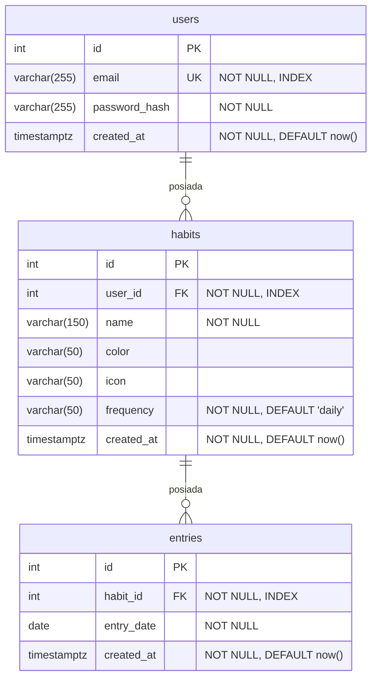

# Habit Tracker - Analiza wymagań danych i ERD

## Encje

### users
Reprezentuje zarejestrowanego użytkownika aplikacji. Każdy użytkownik ma swój niezależny zestaw nawyków.

### habits
Nawyk należący do konkretnego użytkownika. Może być dzienny lub o innej częstotliwości. Zawiera metadane wizualne (kolor, ikona) używane przez frontend.

### entries
Pojedynczy wpis potwierdzający wykonanie nawyku w danym dniu. Unikalność pary `(habit_id, entry_date)` zapobiega dwukrotnemu zaliczeniu tego samego nawyku w tym samym dniu.

---

## Relacje

- `users` -> `habits`: jeden użytkownik ma wiele nawyków (1:N), usunięcie użytkownika kaskadowo usuwa jego nawyki
- `habits` -> `entries`: jeden nawyk ma wiele wpisów (1:N), usunięcie nawyku kaskadowo usuwa jego wpisy
- `users` -> `entries`: pośrednia relacja przez `habits` - wpisy nie mają bezpośredniego `user_id`

---

## Diagram ERD

---

## Ograniczenia i indeksy

| Tabela | Ograniczenie | Szczegóły |
|--------|-------------|-----------|
| `users` | `UNIQUE` | `email` |
| `users` | `INDEX` | `email` |
| `habits` | `INDEX` | `user_id` |
| `entries` | `UNIQUE` | `(habit_id, entry_date)` - jeden wpis na nawyk na dzień |
| `entries` | `INDEX` | `habit_id` |

---

## Uwagi do implementacji

- `frequency` w tabeli `habits` to `varchar(50)` bez ograniczenia `CHECK` na poziomie bazy - dopuszczalne wartości (`daily`, `weekly` itp.) są walidowane przez Pydantic w warstwie API
- Klucze obce mają `ON DELETE CASCADE` - usunięcie użytkownika usuwa jego nawyki i wpisy
- Timestampy używają `timezone=True` (`timestamptz` w PostgreSQL)
- Brak kolumny `user_id` w `entries` - dostęp do właściciela wpisu odbywa się przez `entry.habit.user`
