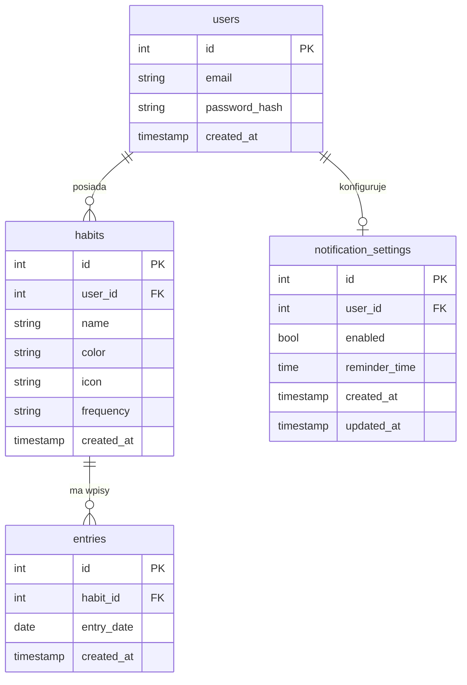

# Habit Tracker - backend
Aby odpalić backend lokalnie należy użyć komend:
```
.venv\Scripts\activate
python -m uvicorn app.main:app --reload
```

## Model danych




### Tabele

| Tabela | Rola |
|--------|------|
| `users` | Konta użytkowników. Hasła przechowywane jako hash bcrypt. |
| `habits` | Nawyki należące do użytkownika. Kolor i ikona służą prezentacji w UI. Pole `frequency` rezerwuje możliwość nawyków tygodniowych (obecnie zawsze `daily`). |
| `entries` | Pojedynczy wpis = wykonanie nawyku w danym dniu. Unikalny constraint `(habit_id, entry_date)` zapobiega duplikatom. |
| `notification_settings` | Relacja 1:1 z `users`. Przechowuje preferencje przypomnień — wyodrębniona osobno, żeby nie rozrastać tabeli users. |

### Widoki i materialized views

| Obiekt | Typ | Rola |
|--------|-----|------|
| `daily_completion_rate` | VIEW | Liczba wykonań nawyku per dzień — używana przez endpoint analityczny. |
| `weekly_completion_rate` | VIEW | Tygodniowy % ukończenia per nawyk (zakłada 7-dniowy tydzień). |
| `user_heatmap_mv` | MATERIALIZED VIEW | Agregat `(user_id, date, count)` dla heatmapy. Odświeżany po zapisie wpisu — eliminuje kosztowne GROUP BY w czasie żądania. |